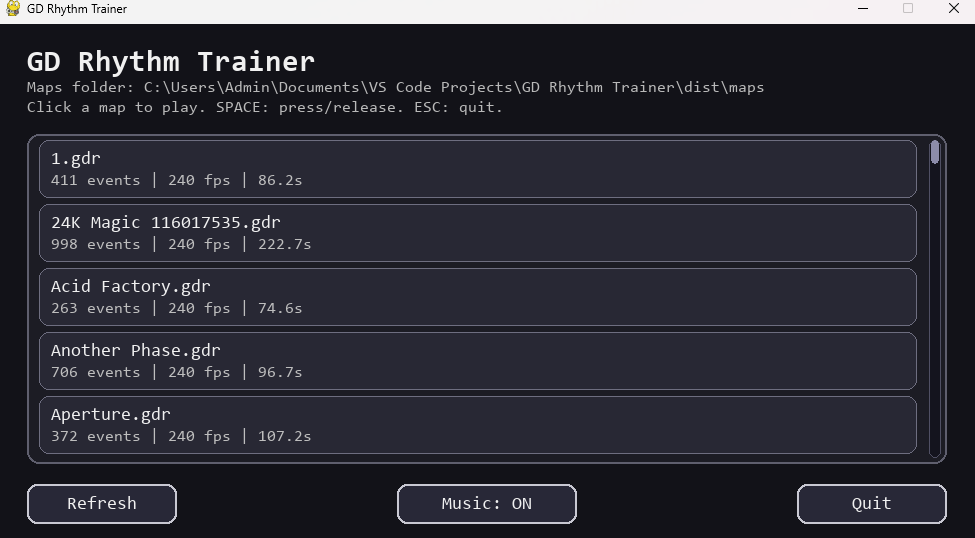

GD Rhythm Trainer
=================

GD Rhythm Trainer is a small desktop tool to practice Geometry Dash maps using custom `.gdr` macro files.

Setup & Usage
-------------
### Dev
- Install requirements: `pip install -r requirements.txt`
- Place your `.gdr` macro files in `maps/`
- (Optional) Place `.mp3`/`.wav` files in `music/` (same filename as the associated `.gdr`) for per-map music
- Run the trainer program: `python gd_rhythm_trainer.py`

### Windows Build
- Place your `.gdr` macro files in `dist/maps/`
- (Optional) Place `.mp3`/`.wav` files in `dist/music/` (same filename as the associated `.gdr`) for per-map music
- Run `dist/GD Rhythm Trainer.exe`

Controls
--------
- SPACE: press/hold to follow the macro
- ESC: end the run and go to results